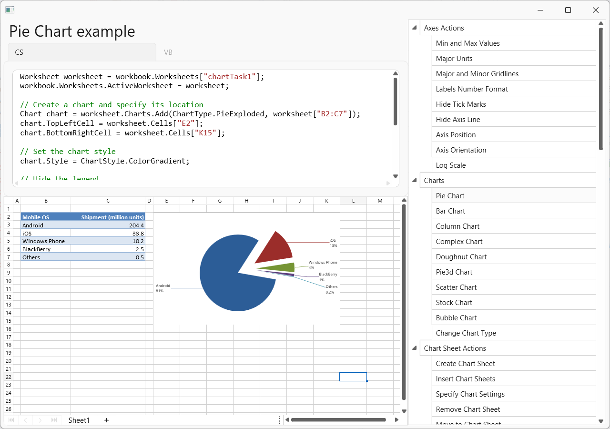

<!-- default badges list -->

<!-- default badges end -->

# WPF Spreadsheet Charts - Manage Charts in Code

This example demonstrates how to use the SpreadsheetControl Chart API to manage charts in code.

The application includes the RichEditControl (at the top) used to display and edit the code, and the SpreadsheetControl (at the bottom), which shows the result of code execution.

You can modify the code and watch the result. The code is executed every two seconds.

## Files to Review

* [CodeExamples](./CS/SpreadsheetWPFChartAPISamples/CodeExamples/) (VB: [CodeExamples](./VB/SpreadsheetWPFChartAPISamples/CodeExamples/))

## Documentation

* [Spreadsheet Chart Overview](https://docs.devexpress.com/WPF/16442/controls-and-libraries/spreadsheet/charts-and-graphics/charting-overview)
* [Spreadsheet Chart Examples](https://docs.devexpress.com/WPF/119713/controls-and-libraries/spreadsheet/examples/charts)
